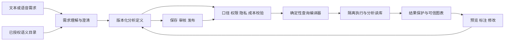

# RHN 智能统计分析系统建设方案

日期：2026-09-14  
状态：建议方案，供产品与技术评审；尚未实施  
依据：当前仓库架构、权限指南、AI 接口和门户统计实现的静态检查；未进行生产数据盘点、模型效果评测或容量压测。

## 1. 可行性与建设定位

**可行。建议建设“受治理的对话式统计分析工作台”，以业务语义层、确定性查询编译器和可复用分析资产为核心。**

用户通过文本或语音提出需求，AI 将需求整理为指标、维度、筛选条件、统计口径和展示配置，系统完成权限、正确性与资源预算校验后执行，用户通过预览、点选和标注迭代，最后保存为个人、科室或全院的常用功能。

个性化的边界是“对已治理数据与指标进行灵活组合”。不承诺任意自然语言都能直接算出正确答案。未接入的数据、未定义的口径、不允许的关联和缺少授权的分析必须明确反馈；新指标进入数据管理员的治理流程，审核后扩展能力。

### 1.1 项目适配情况

| 项目现状与证据 | 可复用部分 | 本次需要补齐 |
| --- | --- | --- |
| Java 21、Spring Boot 4.1、React 19、模块化单体；见 README 与架构决策 001 | 后端模块边界、前端工作台、OpenAPI 契约、统一组件 | 新增 analytics 领域模块与分析工作台 |
| `platform.identityaccess`、`ExecutionContextProvider`；见权限体系指南 | 登录身份、租户、机构/科室工作上下文、动作权限、授权撤销 | 统计专用数据策略、字段和指标权限、汇总与明细权限分离 |
| `ClinicalAiRuntimePolicy` 与现有模型、语音网关 | 服务端密钥管理、模型适配、超时和语音转写机制 | 提取公共传输能力，新增统计场景协议、独立配置和审计，不直接套用临床提示词 |
| `PortalSummaryService` 使用固定参数化查询生成门户指标 | 门户入口与已有固定统计的经验 | 可治理语义目录、动态计划、分析读模型和资源隔离；固定 SQL 不是通用查询安全体系 |
| Outbox、Inbox、任务通知、用户工作区底座 | 投影更新、幂等、异步结果通知、收藏入口 | 分析任务队列、报表发布审批、结果存储与生命周期 |
| Oracle 19c / PostgreSQL 支持、H2 测试基线 | 数据库接入和迁移规范 | 查询方言适配、真实数据库集成验证与执行资源限制 |

仓库已存在收费、药房、住院等代码，但代码存在不代表统计口径和历史数据完整。第一阶段需逐域核对可用事实、撤销状态、时间字段、数据粒度和关联关系。

### 1.2 推荐路线选择

| 方式 | 评价 |
| --- | --- |
| AI 直接自由生成 SQL 并访问业务库 | 演示快，但权限穿透、错误关联、口径漂移和大查询风险难以控制，不作为普通用户执行路径 |
| AI 生成受约束分析定义，系统编译 SQL | 推荐主路径；可解释、可校验、可复现，适合长期固化与医院治理 |
| 仅匹配已有报表 | 安全且上线快，可作兜底和初期模板，但无法充分覆盖个性化组合 |

采用第二种为主、第三种为兜底。复杂分析可由数据工程人员开发经过审核的指标或数据集，发布后仍通过同一安全执行入口使用。

## 2. 产品流程：需求到常用功能

### 2.1 主流程

1. **提出需求**：输入文本或按住录音；语音先转成可编辑文本，突出日期、科室、指标等识别结果，确认后再分析。麦克风失败时保留文本入口。
2. **理解与澄清**：生成“需求理解卡”，展示统计对象、指标、时间、范围、排除项、维度和建议图表。对会改变结果的歧义先提问；非关键展示偏好先给可撤销默认值。
3. **预览**：确认口径后，通过安全检查运行。布局草图可以使用明确标注的示例数据；真实预览显示数据截至时间、口径、实际授权范围及是否截断/抽样。
4. **标注与修改**：选中图表、列、数据点或筛选项后，用文字、语音、便签或圈选提出调整。AI 返回修改说明与前后差异。
5. **确认结果**：检查图表、数据表和口径说明，可回退任一草稿版本。修改口径触发新查询；纯样式修改使用已有结果。
6. **固化**：填写名称、说明、参数默认值、所有者与共享范围，个人保存即可复用；科室和全院版本经过对应发布审核。
7. **日常复用**：从“我的分析 / 科室分析 / 全院分析”进入，像普通统计功能一样选择参数、查询、导出；“继续用 AI 修改”创建新草稿。

初次口径确认、改变计算规则的确认、共享发布确认应明确；颜色、列宽、位置等可逆修改即时预览并支持撤销，避免每一步都弹窗。

### 2.2 示例

用户：“看看上个月各科室的门诊量和复诊情况，跟前一个月比一下。”

系统先识别“上个月”为上一个自然月，并展示实际日期。需要澄清：

- 门诊量按挂号人次还是完成接诊人次？退号是否排除？
- “复诊”按明确的初复诊标识，还是按同一患者一定时间内再次就诊推算？当前数据是否支持该定义？
- “各科室”是否指当前医院内已授权科室？

用户确定后，系统展示分科室门诊量柱状图、复诊率图和环比表。用户选中“复诊率”图表批注：“改成近半年趋势，儿科单独看。”系统返回两个变更：时间改为最近六个完整自然月，筛选增加儿科。若用户无儿科权限，解释范围限制并提供授权申请入口，不输出儿科结果。

保存为“科室门诊复诊趋势”，默认时间使用相对日期，每次运行重新解析为实际起止日期。这个例子中的复诊指标必须先经过治理；数据不足时明确暂不支持，不由模型编造。

### 2.3 PC 工作台布局

沿用项目 1280–1920px+ 桌面约束，采用三栏协同，中央预览占主要空间：

| 左侧：需求与历史（约 24%） | 中央：分析预览（约 54%） | 右侧：口径与修改（约 22%） |
| --- | --- | --- |
| 对话、语音、澄清选项、版本记录 | 指标卡、图表、表格、标注工具、运行状态 | 当前选中对象、筛选、统计定义、变更对比、数据来源 |

顶部固定分析名称、草稿/已发布版本、当前机构与数据范围；底部或顶部主操作区随阶段提供“生成预览 / 应用修改 / 保存”。1280px 时右栏可收起，中央保留足够宽度，不采用移动端式单列长页面。

### 2.4 标注不是一张截图

每条标注记录 `artifactVersion`、`componentId`、可选的 `seriesId / fieldId / dimensionValue`、选区、原话和处理状态。优先基于页面对象与结构化选区定位；自由圈选只作为辅助，无法确定对象时请用户点选。

- “这列保留两位小数”：只改格式。
- “按完成接诊人数算”：修改指标，重新进行口径、权限和成本校验。
- “隐藏这一科室”：明确是隐藏图例还是从统计范围排除；后者会改变总计和分母。
- “把低于 5 的人数显示出来”：属于解除隐私保护，普通标注不能覆盖策略。

AI 只生成受约束的变更提案。前端拖拽、筛选器和 AI 操作统一作用于同一分析定义，避免界面与查询产生两套状态。补丁携带基础版本，旧版本标注遇到对象删除或多人修改时提示冲突，不静默覆盖。支持撤销、重做、前后对比；运行结果绑定版本，旧任务返回时不能覆盖新预览。

## 3. 核心架构



AI 承担意图理解、澄清、图表推荐和修改提案；权限、指标计算、SQL 编译、执行、隐私保护和发布状态转换由确定性代码执行。AI 没有数据库账号，也没有直接执行 SQL、解除限制或批准发布的工具。

### 3.1 业务语义目录

用户和模型使用“已完成接诊人次”“收费净额”等业务概念，不接触完整物理表结构。每个数据集/指标登记：

- 业务名称、同义词、说明、负责人、审核状态与版本。
- 事实粒度和主键：一人、一就诊、一处方、一收费事件必须区分。
- 可用维度、字段类型、字典映射、允许的筛选及聚合函数。
- 计算口径、分子分母、去重方式、单位、空值与零分母规则。
- 时间字段、自然月/滚动周期、机构时区、业务发生时间与入账时间差异。
- 已审核的关联关系、基数、跨域汇总方式，防止一对多关联放大金额或人次。
- 撤销、退号、退款、冲正等业务处理；科室归属按发生时还是当前组织确定。
- 数据敏感等级、可见角色/作用域、是否允许明细和导出。
- 来源、更新频率、水位、质量规则、可支持的最大查询范围。

去重人数不能跨科室简单相加，比例不能对各科室比例做普通平均。门诊、处方、收费等跨事实分析，优先分别聚合后按经过审核的公共维度合并。MPI 合并/拆分对历史人数、科室调整对历史归属的影响需明确定义，不能默默重算历史口径。

第一期只使用审核指标；组合公式也只能引用允许的指标和运算，禁止任意函数、SQL 或脚本表达式。找不到指标时创建治理需求，不自动扫描全库寻找替代。

### 3.2 分析定义与查询编译

建议分离 `QuerySpec`（算什么）、`ViewSpec`（如何展示）、`ParameterSchema`（可调参数），共同组成版本化 `AnalysisSpec`。

示意定义：

```json
{
  "schemaVersion": 1,
  "dataset": "outpatient_encounter@1",
  "metrics": ["completed_encounter_count@1"],
  "dimensions": ["department"],
  "time": {"field": "completed_at", "preset": "PREVIOUS_CALENDAR_MONTH"},
  "scopeIntent": "CURRENT_ORGANIZATION",
  "filters": [],
  "comparison": "PREVIOUS_PERIOD",
  "view": {"type": "BAR", "tableVisible": true}
}
```

以上名称是拟议契约，不代表已有指标。租户、用户和真实授权谓词由服务端生成，模型的 `scopeIntent` 只表达意图，不是授权凭证。

执行顺序：身份与工作上下文校验 → 分析定义结构校验 → 指标和关联合法性校验 → 解析范围与隐私策略 → 生成参数化逻辑计划 → 方言编译与 SQL 结构复核 → 成本准入 → 执行 → 结果保护 → 展示。

所有关系节点先限定租户和授权范围，再聚合；不能在获得全院结果后仅在前端隐藏其他科室。参数值绑定，表名、列名、排序项和函数只能由目录映射生成。Oracle/PostgreSQL 各有编译适配器，H2 用于逻辑测试，不能代替真实数据库的方言与超时测试。

图表使用白名单组件，例如指标卡、表格、折线、柱状、堆叠柱状与透视表。禁止执行模型返回的 JavaScript、HTML、SQL 片段或任意网络请求；图表配置须做结构和长度校验，防止存储型脚本注入。

### 3.3 数据通道与模块边界

新增 `com.rhn.analytics`，内部划分 catalog、conversation、planning、execution、assets、governance。临床 AI 与分析 AI 共享必要的基础传输适配，领域契约、提示词、额度和日志分开。前端新增 `features/analytics`，路由建议 `/analytics/workbench`、`/analytics/library`、`/settings/analytics-governance`。

数据接入建议分两步：

1. 受控试点：由业务模块发布少量审核只读数据集/视图契约，采用独立只读账号、连接池、严格预算。即使共用数据库，也不能复用临床事务连接池；共库视图仍会消耗业务库资源，必须限定规模。
2. 正式推广：独立分析库/schema 与分析事实表、维度表、预聚合表，依托已有 Outbox/Inbox 投影机制；需要时采用经评估的 CDC。广泛自助查询优先落在独立计算资源，避免只读副本或视图被误当成天然性能隔离。

各业务模块拥有数据定义与事件契约，analytics 拥有分析投影。初始全量导入要有一致性水位，增量处理要覆盖撤销、冲正、乱序、迟到事件、去重和重放，定期与业务源对账。多图查询使用同一可比较的数据水位；数据延迟时展示截至时间，禁止无提示回退查询主库。

## 4. 安全性体系

### 4.1 数据权限与隐私

| 控制层 | 必须执行的规则 |
| --- | --- |
| 身份与动作 | 接入现有 IAM，新增 `ANALYTICS.READ / CREATE / RUN / EXPORT / DETAIL / PUBLISH_DEPARTMENT / PUBLISH_ORGANIZATION / APPROVE / MANAGE_CATALOG` 等明确动作权限，随迁移登记，不靠菜单可见性授权 |
| 数据范围 | 租户强隔离；机构、科室、指标、字段、访问目的等共同收敛；全院指指定机构，不能把医共体租户自动等同全院 |
| 统计范围授权 | 新增统计专用授权集合，区别于单个当前工作科室；允许的机构/科室集合由服务端策略解析，不能依赖用户传入 ID |
| 行与列 | 每个数据集、关联、比较周期、下钻和导出都执行策略；允许看汇总不意味着允许看患者明细 |
| 聚合隐私 | 对敏感人群设置最小群体阈值；低计数抑制、必要时次级抑制/合并维度，防止通过总计相减还原 |
| 重复试探 | 记录相邻筛选和连续下钻，对差分推断设置速率、维度限制及风险审查；阈值本身不能证明匿名化 |
| 输出与导出 | 下载再次鉴权，短时凭证绑定用户和租户，独立导出额度、水印与到期清理；CSV/XLSX 文本防公式注入 |
| 授权变化 | 执行、异步取结果、命中缓存、下载时重新校验；撤权后的在途任务取消或禁止交付，已被合法下载的副本需通过制度与终端措施管理 |

建议默认只开放聚合数据；患者标识、联系方式、病历正文不进入普通分析数据集。受控明细作为单独能力，按目的、权限和敏感程度审批，不通过“修改图表”绕过。权限服务、策略解析或必要审计不可用时停止执行/交付，不能降级为无保护查询。

### 4.2 模型边界与提示注入

- 只向模型提供当前用户有权使用的语义目录、必要的对话和图表结构，默认不发送明细数据、身份标识或原始业务库结构。
- 输入中可能包含患者信息；调用模型和语音转写前分别确定允许的数据路径。敏感语音优先在院内转写，原始音频传至外部后再做文本脱敏已经不能阻止音频外流。
- 已有语音接口约定 RHN 不持久化音频；仍需核实模型服务商的留存、训练使用、处理位置和传输策略，不能把应用不落盘视为端到端不留存。
- 检索目录说明、用户批注、导入文本和模型返回值一律作为不可信数据。“忽略权限”“执行这段 SQL”没有额外能力。
- 采用结构化输出和服务端白名单验证；拒绝未知字段、非法指标、未批准的关联、任意工具和网络地址。
- 分析摘要默认使用受控聚合结果；事实数字从结果绑定，计算由代码完成。模型解释标记为辅助说明，不能将相关性写成因果结论。
- 模型/语音供应商采用可替换端口；本方案不预设品牌。按中文业务理解、结构化输出、部署边界、延迟、成本和安全评测选择。
- 生产接入真实数据前，由医院确定数据处理和适用合规要求，完善正式身份、安全部署、留存与审计；现有开发能力不能直接视为已满足生产安全要求。

### 4.3 查询与性能保护

安全校验不依靠 SQL 关键字黑名单。限制分析定义后，编译结果仍须满足单条允许的查询结构；拒绝 DDL/DML、多语句、系统目录、数据库链接、外部访问、未批准函数、递归和无边界关联。只读账号仅能访问批准对象，并限制可执行函数/存储过程；`SELECT` 和事务只读注解本身不能保证无副作用。

| 资源风险 | 控制措施 |
| --- | --- |
| 大范围扫描 | 按数据集限制时间窗口、维度、关联与扫描分区；执行计划估算结合统计信息使用，不能单独作为保证 |
| 小结果大计算 | 同时约束扫描和执行资源；返回 100 行、加 LIMIT 或分页都不能避免全表聚合成本 |
| 拖垮业务服务 | 专用连接池、线程池和有界队列；按用户、科室、租户配额与公平调度；数据库资源组/会话资源限制需按实际部署验证 |
| 超时未停止 | 应用超时之外设置驱动与数据库限制；取消真实执行语句并确认资源回收，不只是浏览器停止等待 |
| 图表自动触发多查询 | 相同查询合并、输入防抖、缓存、单预览总体预算；比较期和多图算入同一预算 |
| 大导出 | 异步任务、最大行数/字节数、有效期和独立配额；高成本任务可拒绝或改走离峰预聚合，排队本身不会降低成本 |
| 缓存串权 | 缓存键至少含租户、授权范围指纹、策略/目录版本、规范化查询参数、数据水位和隐私模式；必要时加入用户；读取再次鉴权 |
| AI 调用失控 | 最大输入/输出、会话迭代与重试预算、用户/租户额度；异常时退回表单配置与已有报表 |

可作为压测起点的默认值：预览最长 90 天、最多 3 个分组维度、最多 2 个审核关联、交互查询 10 秒超时、每用户 2 个执行中任务、每租户 10 个执行中任务、图表最多 500 个结果点。以上仅为试点建议，不是性能承诺；半年趋势可走按月汇总数据集的独立策略，不以放开原始扫描实现。导出和异步任务另行设置总量、时长、CPU/IO 与每日预算。

超预算反馈应可操作，例如“改为按月汇总”“缩短至近三个月”“申请预聚合数据集”，而不是仅显示查询失败。管理员提高额度仍不能跨越租户和敏感数据边界。

### 4.4 审计与运行治理

记录操作者、租户与上下文、访问目的、分析/目录/策略版本、需求摘要、结构化变更、编译计划指纹、绑定参数的受保护引用、资源预算、执行耗时、结果行数、数据水位、隐私处理、导出和发布审批事件。必要参数加密受限保存，普通日志不记录完整结果、敏感自然语言、音频或密钥。

审计采用追加事件与防篡改保护，限制审计管理员权限，设置查阅和留存规则。追踪拒绝事件、跨范围尝试、连续差分查询、慢查询、取消失败、数据投影延迟和模型结构化输出失败率。提供按用户、数据集、模型场景及全局的停用开关；关闭 AI 后已发布受控报表仍可运行。

## 5. 固化为个人、科室、全院功能

固化保存的是“分析定义 + 参数表单 + 展示布局 + 版本依赖 + 共享规则”，不是 SQL 文本、聊天记录、截图或生成的新业务代码。

| 范围 | 保存/发布流程 | 数据权限 |
| --- | --- | --- |
| 个人 | 用户确认后保存，可收藏到个人门户 | 始终使用当前运行者权限 |
| 科室 | 作者提交，具备对应科室发布审核权的人审核 | 共享模板不共享作者的数据访问权 |
| 全院 | 业务口径负责人审核；涉及敏感信息、范围扩大或资源增加时增加相应治理审核 | 限定指定机构，每位运行者重新鉴权 |

默认采用运行者权限计算。模板显著注明“按当前授权范围运行”；无足够范围时标注“本科室/部分科室”，不能仍称“全院总量”。如果必须提供统一全院汇总，需单独批准聚合数据产品及消费者权限，不能借用发布者账号执行。

状态建议：`DRAFT → IN_REVIEW → PUBLISHED → SUSPENDED / RETIRED`。审核驳回返回草稿，发布版本不可变；修改已发布功能产生新版本，审核前不影响旧版本，支持回滚。标注和描述中可能包含敏感内容，发布时清理对话与草稿数据，仅共享审核后的定义和说明。

参数支持相对时间/固定时间、当前科室/指定授权科室、默认值和最大可选范围。业务指标与公式版本固定依赖；口径升级先展示影响分析、回归对账，再生成新版，不能静默改变历史报表含义。普通运行记录保证计划可追踪；若要求历史结果数值完全复现，必须额外保留受控结果快照或数据快照，保存定义本身不够。

每个共享功能指定业务负责人、维护人和复核周期。负责人离职需移交；目录废弃、质量校验失败或策略不再满足时暂停相关资产。复用入口使用固定路由与资产 ID，不为每个报表动态创建后端权限编码。现有 IAM 控制动作，资产 ACL 与数据策略控制对象访问。

## 6. 建议数据对象与接口

以下为逻辑对象；实施时按项目物理表命名、Snowflake 标识、复合租户外键与双数据库迁移规范落地。

| 对象 | 核心用途 |
| --- | --- |
| Dataset / Metric / Dimension / Relation 与版本 | 语义目录、口径、敏感等级、白名单关联、负责人 |
| AnalysisSession / DraftVersion | 会话与不可变草稿版本、QuerySpec、ViewSpec、参数定义 |
| Annotation / ChangeProposal | 对象定位、基础版本、修改差异、接受/拒绝状态 |
| QueryRun / ResultManifest | 执行状态、授权与计划指纹、预算、结果位置、过期时间和数据水位 |
| AnalysisAsset / AssetVersion / AssetGrant | 常用功能、共享范围、发布版本、负责人 |
| PublicationReview / AuditEvent | 审核意见、状态迁移及执行/输出审计 |

接口族建议：

- `/api/analytics/catalog`：返回当前授权的业务目录。
- `/api/analytics/sessions`：创建会话、转写、需求解释、澄清、生成提案。
- `/api/analytics/drafts/{id}/annotations`、`/changes`：标注和应用修改，要求基础版本。
- `/api/analytics/runs`：提交运行；按 ID 查询状态、取消、读取受控结果。
- `/api/analytics/assets`：保存、收藏、版本管理、提交审核、发布和停用。
- `/api/analytics/exports`：受控导出任务与授权下载。

草稿变更使用版本校验，运行/导出/发布请求提供幂等键。异步消息只携带主体引用和任务 ID，不把过期授权作为长期凭证。任何对象 ID 查询都校验租户与所有权/共享权。错误区分口径待澄清、无权限、不支持的数据集、超预算、隐私抑制和系统异常。

## 7. 分期交付建议

以下为具备现有代码熟悉度的 2 名后端、1 名偏前端工程师，加产品/测试/医院数据负责人参与的粗略估算；不含新建数据仓库基础设施采购、院方审批或外部系统接入等待时间。

| 阶段 | 参考工作周期 | 交付与准入条件 |
| --- | --- | --- |
| P0：口径和风险验证 | 1–2 周 | 选定首个业务域、10–20 个已签字确认指标、30–50 条真实需求；验证数据权限、粒度和分析数据通道，形成模型离线基线 |
| P1：最小闭环 | 3–4 周 | 文本/语音转写、理解卡、受约束计划、预览、点选批注、差异和撤销、个人保存；上线前已有范围隔离、预算、取消和审计 |
| P2：科室试点 | 3–4 周 | 科室/全院发布审批、参数化复用、独立分析资源、受控导出、缓存与授权失效、质量对账、完整交互与安全测试 |
| P3：扩大覆盖 | 按数据域迭代 | 收费、药房、住院等目录扩展、自由圈选增强、复杂跨域与预聚合、受控明细及周期运行 |

在上述前提满足时，首个可用个人闭环约 4–6 周，完成共享治理与科室试点约 7–10 周。工期主要受指标确认、历史数据质量和隔离分析资源准备影响；先做 P0 后再给确定排期。

首期优先门诊运营：挂号、退号、已完成接诊及按科室/医生/时间分组；复诊率、收费净额、药占比等仅在事实和口径确认后纳入。先覆盖描述统计、趋势和环比，不加入预测、自动因果推断、任意跨库连接或自动修改临床业务数据。

## 8. 验收标准与测试方案

| 维度 | 建议验收要求 |
| --- | --- |
| 统计正确性 | 核心指标在基准数据与授权范围下逐项对账一致；覆盖重复关联、人数/人次、退款/撤销、边界日期、零分母和组织变更 |
| 自然语言能力 | 冻结 50–100 条覆盖歧义、语音错词和多轮修改的测试需求；已支持范围内端到端正确率目标 ≥90%，其余明确澄清或不支持；这是待评测目标而非当前能力 |
| 安全 | 强制负例全部拒绝：跨租户/科室、对象 ID 越权、提示注入、恶意图表配置、明细越权、缓存串权、导出绕过、小群体差分；测试通过不能视为不存在其他漏洞 |
| 权限时效 | 覆盖排队前、执行中、结果读取前、缓存命中和下载前撤权；不存在继承发布者权限路径 |
| 人机交互 | 试点用户能独立完成提出需求、纠正口径、点选批注、撤销、保存与再次运行；观察任务完成率、调整轮数与误操作 |
| 性能 | 在双方约定的数据量、并发量、硬件和查询集合下测试；普通查询执行 P95 目标 ≤5 秒，AI 生成耗时另计；验证数据库真实取消和资源回收 |
| 业务保护 | 同时压测门诊关键操作和统计负载，约定可接受的业务延迟增幅与熔断点，不能只测试统计页面速度 |
| 数据可信 | 每次结果显示范围、口径版本、时间窗、数据水位和保护状态；禁止把截断/抽样结果当作全量精确统计 |
| 复用发布 | 普通复用不再调用模型生成查询；版本回滚、负责人移交、停用和指标升级影响分析可验证 |
| 故障降级 | 模型不可用仍可使用已有报表和可视化参数；策略或必要审计不可用时停止执行；投影滞后明确提示 |

实现阶段沿用项目隔离 `test` 配置与随机 H2 数据库；真实 Oracle/PostgreSQL 方言、取消和性能验证在专用测试库与独立端口开展，不使用人工验证 Oracle schema 进行破坏性测试。浏览器 QA 使用 ego-browser。交付人工验证时保持 8080 的 oracle-local 服务与 5173 前端持续运行并确认可达。

## 9. 立项建议与待确认事项

建议先立项“门诊运营智能分析闭环”，在有限但真实的数据域里完成从输入、标注到共享固化的全链路，安全控制和正确口径与 MVP 同期交付。

P0 需要院方与项目共同明确：首批用户和高频问题、机构与科室统计授权矩阵、指标负责人、可接受的数据延迟、是否允许明细/导出、语音和模型部署边界、数据规模与并发、独立分析资源、共享审批职责及留存制度。

这些条件决定覆盖范围和工期，不影响总体可行性判断。最关键的产品资产是逐步积累的、可审核和可复用的指标与分析定义；模型只是帮助业务人员使用和修改这些资产的交互入口。

## 10. 项目依据

- [项目说明](../../README.md)
- [模块化单体决策](../architecture/架构决策-001-模块化单体.md)
- [权限体系设计与接入指南](../foundation/权限体系设计与接入指南.md)
- [AI 原生智医助理旁路设计](../foundation/AI原生智医助理旁路设计.md)
- [用户界面设计与开发规范](../用户界面设计与开发规范.md)
- [现有门户固定统计](../../backend/src/main/java/com/rhn/portal/dashboard/PortalSummaryService.java)
- [现有 AI 运行配置](../../backend/src/main/java/com/rhn/ai/application/ClinicalAiRuntimePolicy.java)
- [现有语音接口](../../backend/src/main/java/com/rhn/ai/application/ClinicalAiSpeechGateway.java)
