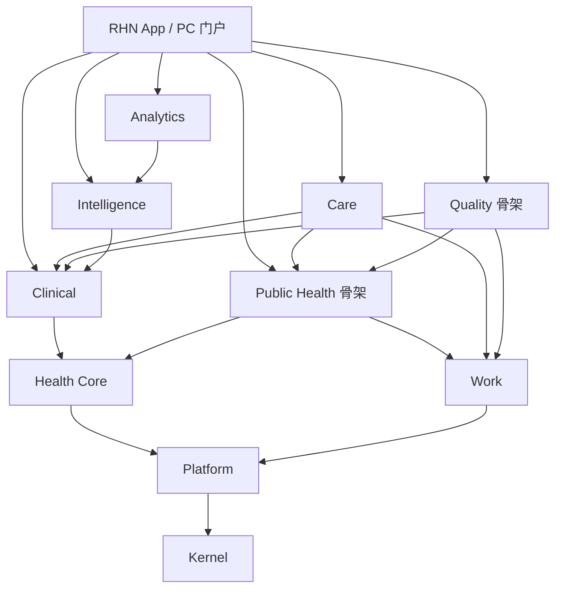

# RHN 2.0 模块架构基线

- 决策日期：2026-09-15
- 状态：采纳；本轮落地物理模块和依赖门禁，公卫与质控业务按后续切片建设
- 讨论来源：[评估模块化单体架构](https://chatgpt.com/c/6aa8b86d-953c-83e8-8af5-f2e7b3a484b0)
- 配套决策：[ADR-006](架构决策-006-物理模块化与依赖倒置.md)

## 可行性结论

采用「可拆分的模块化单体核心 + 按运行需求独立的 Worker/卫星服务」。医疗、公卫、照护共享居民身份、健康事实与任务协作，当前保留单进程、同数据库事务，比立即拆分服务更适合现有业务。现有 Outbox、Inbox、幂等事件投影和公开 API 可继续复用。

这不是容量保证。未来仍需按机构数、并发接诊数、事件吞吐量、报表数据规模做压测，再决定容量和独立部署边界。Java 21、Spring Boot 4.1、Oracle/PostgreSQL 的当前技术基线不变。

核查发现原架构测试已存在循环依赖，且 portal、queueing、workmanagement 未全部纳入同一套业务边界检查。先修复依赖方向再做物理搬迁，禁止通过忽略循环、冻结失败或放行内部包获得通过。

## 已落地的工程边界

Maven 工程代表部署内的粗粒度能力组，逻辑包代表领域边界。多个领域进入同一个 Jar 后，仍受各自 API 与无循环规则约束。保留现有 Java 包名，避免无业务收益的全量命名迁移。

| Maven 工程 | 当前逻辑包（com.rhn 下） | 职责与数据 Owner |
|---|---|---|
| rhn-kernel | shared | ID、错误契约、执行上下文、JSON 等共用技术类型；不得加入业务实体 |
| rhn-platform | platform | IAM、组织、术语、配置、密码、事件、幂等、打印、实时消息及现有通用集成 |
| rhn-health-core | healthcore | MPI、人口学、保障、过敏、Condition、不可变文档版本及健康时间轴投影 |
| rhn-work | workmanagement | 通用工作任务、通知和工作台待办投影 |
| rhn-clinical | outpatient、inpatient、pharmacy、billing、diagnostics、treatment、queueing | 接诊、医嘱、处方、库存、费用、检查检验、处置、排队等业务事实 |
| rhn-public-health | publichealth | 本轮仅工程骨架；后续拥有公卫档案、纳管、随访和专项服务记录 |
| rhn-care | healthplanning、coordination | 候选识别、照护任务及证据、医疗协同；后续照护计划、目标、干预与异常闭环 |
| rhn-quality | quality | 本轮仅工程骨架；后续拥有规则版本、评价、问题、证据和整改关联 |
| rhn-intelligence | ai | 模型接入、建议、语音、提示与运行记录；不拥有病历、诊断、处方或随访事实 |
| rhn-analytics | analytics | 分析方案、审计和统计能力；保留现有统计工作，不并入医疗交易模型 |
| rhn-app | RhnApplication、portal | Spring Boot 装配、门户聚合及当前用户工作区偏好 |

生产代码位于 `backend/rhn-*/src/main/java`。数据库迁移、配置与回归测试暂保留 `backend/src/main/resources`、`backend/src/test`，由 rhn-app 显式装配。迁移文件顺序和内容保持不变，避免破坏 Flyway 校验及 Oracle 持久化数据。运行制品为 `backend/rhn-app/target/rhn-application-0.1.0-SNAPSHOT.jar`，只有 rhn-app 执行 Spring Boot 可执行打包。

机器可读登记源为 [module-catalog.json](../../backend/src/main/resources/architecture/module-catalog.json)：每个逻辑包登记 artifact、owner、status、allowedDependencies 和公开契约例外。owner 当前表示领域责任角色，不编造具体人员。



箭头表示编译依赖，运行调用可以通过依赖倒置反向进入实现。例如医疗调用自身定义的筛查 Port，由 Care 实现；医疗 Jar 不依赖 Care Jar。运行装配必须提供这些 Port 的实现，当前 rhn-app 完整提供，不支持随意移除 Jar。

## 依赖和数据规则

1. 顶级业务包必须登记；新增源码必须处于登记的 Maven 工程。无法登记的包、入口层反向依赖及未声明的模块依赖均使测试失败。
2. 跨逻辑模块只使用公开 API/Port、不可变快照、ID 和事件。禁止引用其他模块的 Repository、Entity、application、infrastructure 或 web 实现；即使两个模块属于同一个 Jar 也不例外。
3. platform 只依赖 shared；healthcore 不依赖 clinical；shared 不依赖任何业务模块。所有顶级包统一检查循环依赖，包含 portal、queueing 和 workmanagement。
4. API 不暴露 JPA Entity。业务表归实现其实体和写入行为的模块拥有，共享数据库实例不等于共享表的写入权。
5. 当前三个非 `.api` 稳定平台契约为 `IdempotencyService`、`IdempotencyReservation`、`TenantContext`，以精确类型登记，不放开整个包。新契约应进入 `.api`，后续迁移这三个历史入口。
6. 需要其他模块实时校验的强一致决策走同步 API/Port，并明确事务责任；状态传播、通知、异步质控和上报复用事务 Outbox/Inbox。独立 Worker 不共享当前线程事务，要设计幂等、超时、重试和补偿。
7. 当前架构门禁检查 Java 依赖，不能证明任意 SQL 字符串没有越权 JOIN。原生 SQL、JdbcTemplate 和迁移的表归属仍需评审；新增跨域报表走有 Owner 的 Read Model/投影，不新增任意交易表联查。

当前实际依赖白名单以 Module Catalog 为准。未来增加 Care → 公卫 API、Quality → 业务 Port 等调用时，同时评审目录、允许方向和无循环门禁。不能把所有模块一次性相互放行。

## 本轮具体解耦

| 原问题 | 修复方式 | 需要保留的行为 |
|---|---|---|
| 平台打印直接依赖 TreatmentExecutionService 和处置 DTO | Platform 定义 MedicationPrintSource 与不可变快照，由 Treatment 提供 Adapter | 继续走原授权 worklist、工作上下文过滤、批次去重和打印证据 |
| 退费前置检查与医技/处置反向依赖形成循环 | RefundDiagnosticDirectory、RefundTreatmentDirectory 移至 billing.api，由医技/处置实现 | 原有报告/执行状态阻断与退费策略 |
| 门诊直接依赖 Care 接口，阻碍 Clinical/Care 物理分离 | HypertensionCareDirectory 作为医疗消费 Port 移至 outpatient.api，由 Care 实现 | 同步筛查、原规则证据和原事务链 |
| 收费日结直接锁平台 UserAccountRepository | 使用 IdentityAccessDirectory.lockAccount | 保留租户条件和悲观锁，强制加入调用方事务，账号不存在错误仍由收费返回 |
| 业务实时桥接依赖连接管理内部实现 | RealtimePublisher API | 原有租户、权限、机构/科室及收件人过滤 |
| shared 错误处理器反向依赖平台过滤器 | HTTP 异常适配器归入 platform.web，共享层只保留错误及关联 ID 契约 | HTTP 状态码、错误内容、关联 ID 保持一致 |
| 平台配置编译依赖 AI 权限常量 | 常量归入平台配置 API | 权限字符串及既有授权检查不变 |

## 与讨论稿的适配和剩余迁移

- 保留独立 rhn-analytics；统计功能已经存在，不应藏入 App 或 Kernel。
- 暂不创建空 rhn-integration。通用集成能力留在 Platform，医保/财政等业务适配器保留原领域；未来抽取时由业务定义 Port、外部集成实现 Adapter，不允许平台反向依赖业务。
- 通用不可变 ClinicalDocument 版本、签署证据暂留 Health Core。病历模板、业务流程及公卫档案由各自领域负责，不因复用文档存储而转移数据 Owner。
- 观察事实当前仍有 Diagnostics/Inpatient 等来源实现，Health Core 已有公开观察查询 Port。本轮不迁移表或改写历史事实；后续统一 Observation 归属需要独立迁移方案，不能声称已经归并完成。
- rhn-kernel 是现有 shared 的物理提取，仍含框架适配器和通用报表执行器，不是完全框架无关的纯领域内核。继续收敛时将 SQL 执行移至平台/统计基础设施，禁止新增领域实体和业务规则。
- Work 负责通用任务和待办；现有 `CareTask` 是照护任务权威，`work_tasks` 是岗位投影。业务确认和完成规则继续由 Care 控制，不能用修改工作台待办替代业务闭环。

## 后续切片按此推进

### M4.2：照护计划与首个公卫闭环

在 rhn-care 增加 CarePlan、Goal、Intervention 与临床确认；引用 Health Core 的居民及健康事实契约。Care 负责计划状态和跨领域闭环，Public Health 负责纳管资格、专项服务及随访事实，Work 负责执行任务入口和通知。

rhn-public-health 内按 `record`、`hypertension`、`diabetes`、`elderly`、`child`、`maternal`、`mentalhealth`、`tuberculosis`、`infectiousdisease`、`tcm`、`immunization`、`healtheducation`、`reporting` 划分领域包，按业务切片逐个建立，不批量生成无行为 CRUD。人口学身份属于 MPI；建档机构、责任医生、档案状态与公卫调查属于公卫档案。

先交付「临床确认 → 照护计划 → 高血压纳管/随访 → 异常回流」纵向闭环，并验证租户/机构隔离、状态机、事实版本、Outbox/Inbox 幂等和重复提交。当前候选识别不能自动确诊或自动纳管。

### 合理用药、病历质控、档案质控

新增业务消费 Port 置于 Clinical/Public Health 的 API 内，由 rhn-quality 提供 Adapter。用药快照应携带租户、就诊/处方 ID 和版本、药品/剂量/途径、过敏与必要健康事实版本；结果区分允许、警告、阻断与服务不可用，不能把不可用伪装成检查通过。

质量模块统一建模 RuleDefinition/RuleVersion、QualityEvaluation、QualityFinding、Evidence、Remediation 关联。同步轻规则用于保存/提交/签署前检查；异步深度质控通过 Outbox 消费已提交的不可变版本，按事件 ID 与规则版本幂等，结果通过业务确认与任务闭环应用。医嘱阻断、超时和降级策略必须按医疗规则单独验收，不在空骨架中提供恒通过实现。

现有过敏、审方与签署校验继续生效；迁入统一质量模块应逐项回归，不重复执行，也不能用未完成的新引擎替代既有规则。

### 独立部署的触发条件

有独立扩缩容、独立发布、不同技术栈/GPU、明确故障隔离或团队边界的证据时才抽取服务。优先候选为 AI 推理、批量质控、区域上报和 BI。拆分前需具备版本化契约、不可变输入、独立数据 Owner、幂等/重放、失败策略和可观测性；核心门诊、药房和费用事务继续留在单体。

## 开发与验证入口

```bash
cd backend
mvn -Dtest=ArchitectureTest,ModuleCatalogTest test
mvn verify
```

前一命令验证所有生产模块，包含新包登记、工程归属、公开 API、Entity/Repository 边界和循环依赖；反例测试证明未知包和外部仓库访问会失败。后一命令运行集中回归并生成可执行制品。模块源码迁移不自动提交或推送。

长期人工环境保持主工作区 `8080/5173`、统计工作区 `18086/15176`，两个后端均为 oracle-local。自动回归使用 test + 随机 H2；打包烟测使用专用临时端口，仅清理本任务启动的进程。CI 的 OpenAPI 烟测同样使用 test + 随机 H2。
