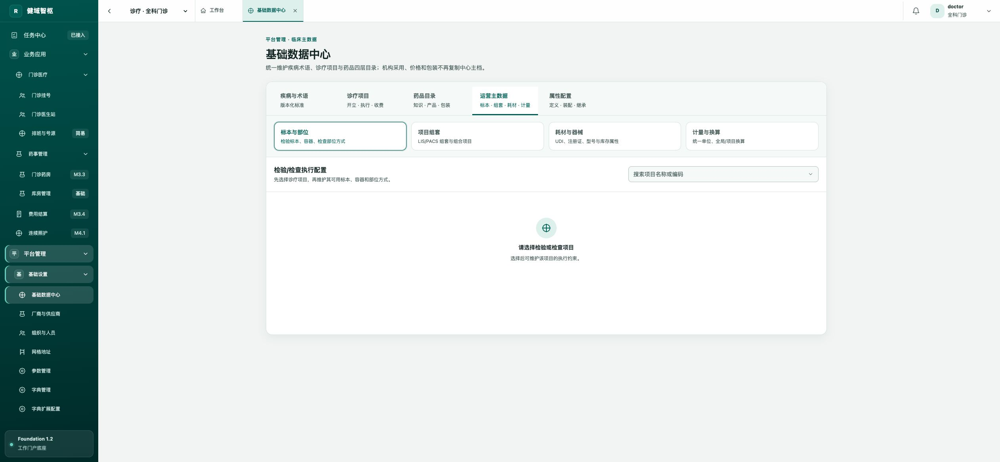
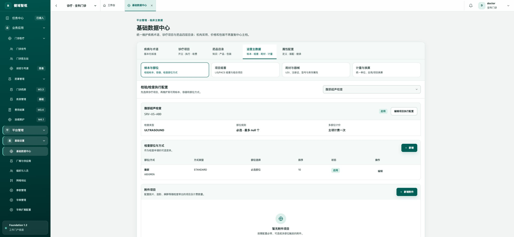
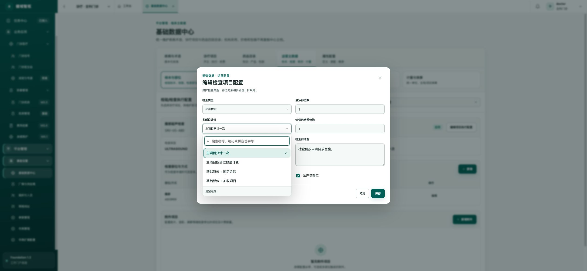
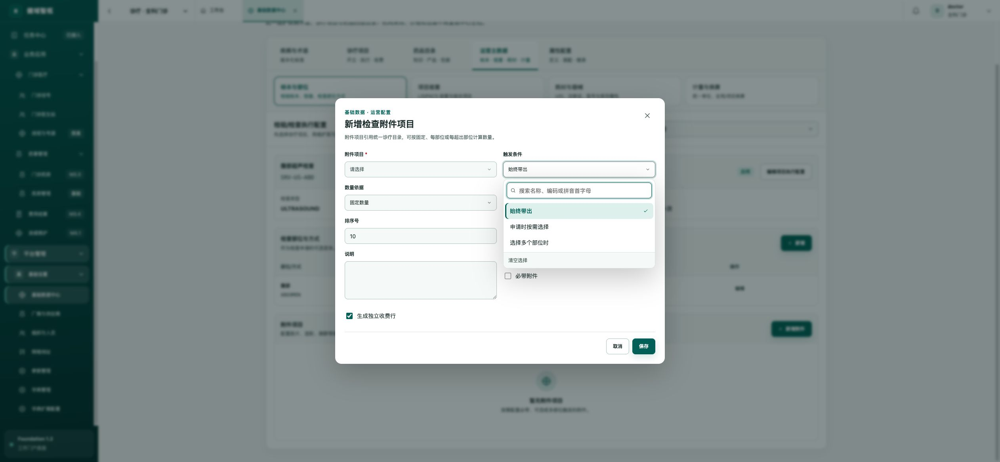
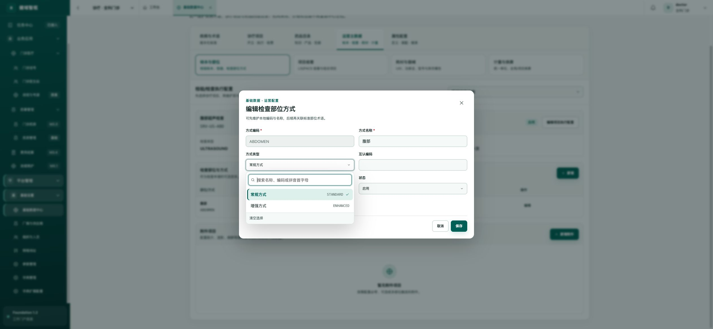
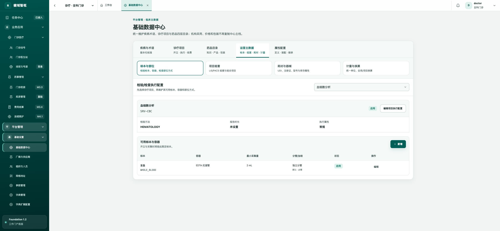
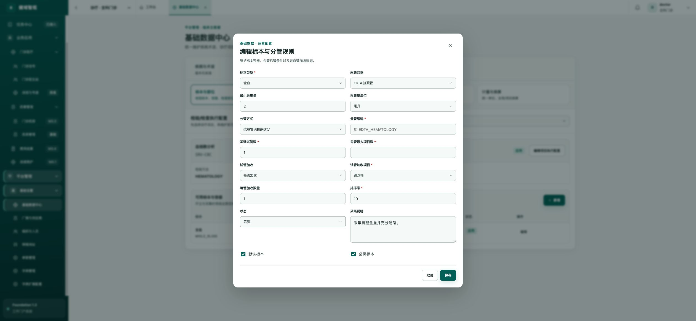
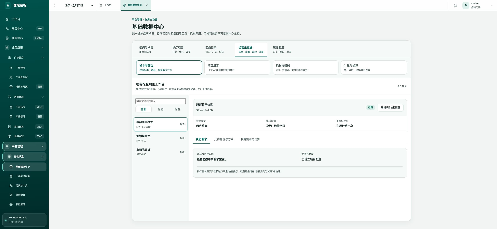
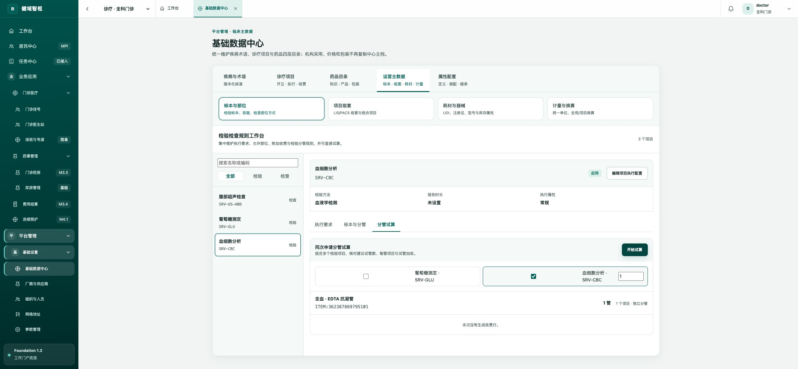

# 检验检查附加项目、多部位计价与分管规则走查

## 审查结论

当前能力已经能覆盖以下基础场景：检查项目选择部位、简单多部位计价、随检查带出附加收费项、检验标本与容器限定、按项目数拆管以及试管加收。

但它仍属于“单项目静态参数配置”，尚不足以支撑医院日常运营中的复杂组合、差异化范围、规则追溯和收费解释。最优先的问题是：诊疗项目与运营配置存在双数据源；部位和检查方式混在一个模型中；收费与分管规则缺少条件、范围、版本和试算；页面还暴露了 `null`、英文枚举和业务命名不准确等完成度问题。

## 走查步骤与健康度

1. **进入基础数据中心 → 运营主数据 → 标本与部位** — **需改进**
   页面结构清楚，但必须先用单个下拉框选择项目；项目量大后缺少按检验/检查类型、规则完整度、机构适用性和异常状态筛选的工作台视角。

   

2. **选择腹部超声检查并查看当前配置** — **存在缺陷**
   页面直接显示“最多 null 个”，检查类型和方式仍显示 `ULTRASOUND`、`STANDARD` 等英文枚举；“检查部位与方式”把不同业务维度合并在同一列表中。

   

3. **编辑检查项目配置并开启多部位** — **部分可用**
   已支持主项只计一次、按部位数量计费、固定金额加收、附加项目加收四种模式，也支持包含部位数和最大计费部位数。但没有左右侧、组合部位、部位组、阶梯计价、百分比、封顶金额、按实际执行结果计价等规则；页面也不能预览最终收费结果。

   

4. **新增检查附加项目** — **不足以支撑实际业务**
   当前只有“始终带出、申请时按需选择、选择多个部位时”三个触发条件，无法表达按部位/方式/造影/麻醉/设备/患者类型/结算类别/机构科室等条件。名称“附件项目”容易被理解成文件附件，建议统一改为“附加收费规则”。

   

5. **编辑检查部位方式** — **模型混淆**
   示例中“腹部”被当作方式名称，方式类型又是“常规/增强”，同时存在“仍需选择标准部位”。这说明部位、左右侧和执行方式没有被拆开，开立、执行与收费很难形成稳定口径。

   

6. **选择血细胞分析并查看标本容器** — **基础能力可用**
   已能维护标本、容器、最小采集量、默认/必需标本和分管方式，是合理的起点。但项目页只呈现本项目规则，无法判断与同次申请中其他检验项目能否共管、需要几管。

   

7. **编辑分管与试管加收** — **部分可用**
   已支持独立分管、同组共管、按每管项目数拆分，以及每管/超出包含管数后加收。但缺少跨项目组合计算、容器容量与采集量校验、特殊互斥条件、儿童/成人采集差异、实际采集管数回写、试算和命中说明。

   

## P0 问题

### 1. 收敛检查计价的双入口与双数据源

- 诊疗项目主档仍维护 `multiSitePrice/freeSiteCount/maxBodySiteCount`。
- 运营配置又维护 `sitePricingMode/includedSiteCount/additionalSiteItemId/maxChargeableSiteCount`。
- 当前只有主档到运营配置的单向兼容同步，反向修改不会同步，容易出现两个页面结果不一致。

建议以运营规则模型为唯一写入口，旧字段只读兼容；迁移完成后移除旧字段和旧表单。

### 2. 拆分部位、左右侧与检查方式

当前 `service_variants` 同时承载部位、方式、互认编码和“仍需选标准部位”标志。建议拆为：

- `examination_body_site_option`：标准部位、部位组、左右侧策略、默认值、排序、状态。
- `examination_method_variant`：平扫/增强、造影方式、体位、序列或设备能力。
- 开立保存申请部位，执行保存实际部位与方式，收费保存采用的执行事实快照。

### 3. 将“附件项目”升级为条件化收费规则

建议建设：

- `examination_charge_rule`：主项目、规则类型、适用范围、有效期、优先级、叠加/互斥策略、状态、版本。
- 结构化条件：部位组、左右侧、方式、部位数量、是否增强/麻醉、设备、机构、科室、患者类型、结算类别。
- `examination_charge_action`：收费项目、数量基数、数量、包含数量、封顶数量、自动带出/默认勾选/必须确认、是否允许人工调整。

同一个附加项目应允许在不同条件下配置多条规则，但相同条件组合必须做冲突检查。

### 4. 分管规则应从“单项目参数”升级为“同次采集组合规则”

实际管数需要综合本次申请的全部检验项目、标本类型、容器/添加剂、最低采集量、容器容量、是否可共管、设备/方法分组和特殊互斥条件计算，而不能只读取某个项目的基础管数。

建议新增分管规则组与组合计算服务，输出：建议采集管清单、每管包含项目、拆管原因、加收项目、人工调整原因，并在采集确认后以实际管数结算。

### 5. 规则必须具备范围、有效期、版本和解释

- 支持平台模板 → 租户 → 机构 → 科室/设备的覆盖。
- 支持生效/失效日期、发布版本、变更原因和历史追溯。
- 解析时按更具体范围优先，同范围再按优先级和版本决策。
- 每次试算和正式收费都输出命中规则、数量计算过程和未命中原因。

## 页面优化建议

1. 用左侧项目列表替代单一下拉框，支持检验/检查类型、规则完整度、机构、状态、异常筛选。
2. 右侧按“执行要求、允许部位与方式、收费规则”三个页签组织，避免把执行与收费字段混在一个弹窗。
3. 收费规则以“条件 → 动作”展示，例如“实际执行部位 > 1 且方式=增强 → 每超出1个部位加收×1”。
4. 固定提供“规则试算”区，输入部位、左右侧、方式、机构和实际管数后，显示命中规则及最终收费行。
5. 增加模板复制、批量应用、差异比较、冲突检测、发布审批和变更影响分析。
6. 修复 `null` 直出；所有枚举显示中文名称并在浅色位置保留编码；空值统一显示“未限制/未设置”。
7. 将“附件项目”改为“附加收费规则”，将“检查部位方式”拆为“允许部位”和“检查方式”。

## 推荐实施顺序

1. 收敛双数据源，并修复 `null`、英文枚举和命名问题。
2. 拆分部位、左右侧与检查方式，收费接口改用结构化执行事实。
3. 建立条件化收费规则、范围、有效期、版本与冲突策略，迁移现有多部位和附加项目配置。
4. 建设跨项目分管计算与实际采集管回写，统一试管加收来源。
5. 增加规则试算、命中解释、批量模板、发布审批和影响分析。

## 证据与限制

- 本轮已在本地开发环境完成自动登录并走查上述页面，没有保存任何测试修改。
- 结论同时参考了前端表单、领域模型、数据库迁移、收费解析逻辑和自动化测试。
- 截图可证明页面结构、文案和可见状态，但不能单独证明键盘操作、焦点顺序、读屏标签或 WCAG 对比度；无障碍需另做键盘与辅助技术测试。

## 本轮已落地优化

- 将单一下拉框改为 PC 端左侧项目工作列表，支持名称/编码搜索以及检验、检查分类筛选，并默认打开第一个项目。
- 项目维护拆为“执行要求、允许部位与方式/标本与分管、收费规则与试算”三个明确页签。
- 修复 `null` 直出，检验方法、检查类型和检查方式改为中文名称展示。
- 将“附件项目”统一更名为“附加收费规则”，按“触发条件 → 收费动作”展示。
- 接入检查收费规则试算：选择实际部位和按需收费项后直接展示部位数量、加收数量与最终收费行。
- 接入同次申请分管试算：可组合多个检验项目，展示建议管数、标本容器、分管方式和试管加收。

优化后工作台：

优化后检验分管试算：

