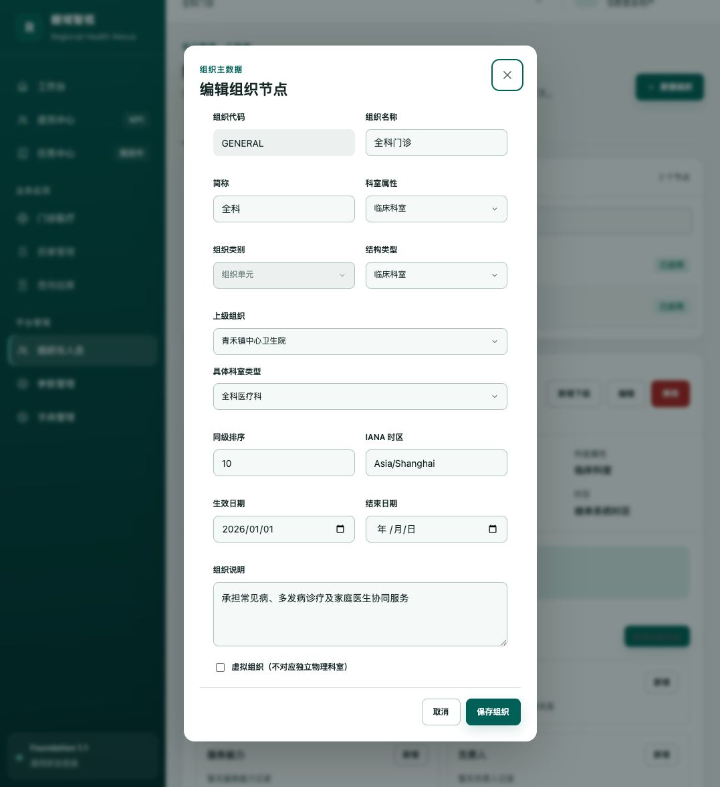
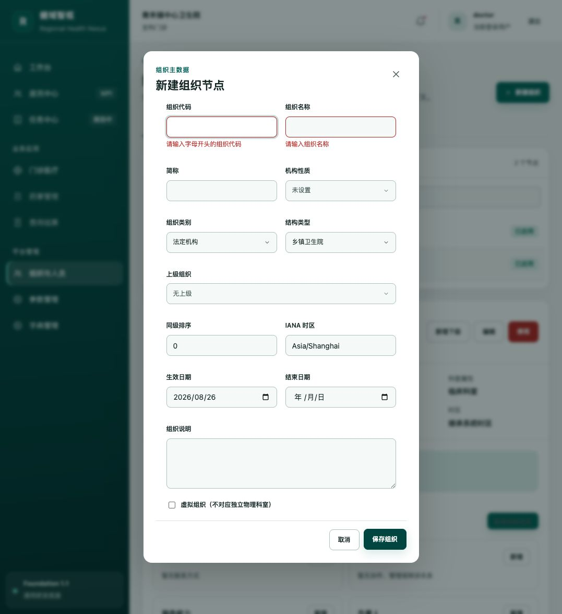
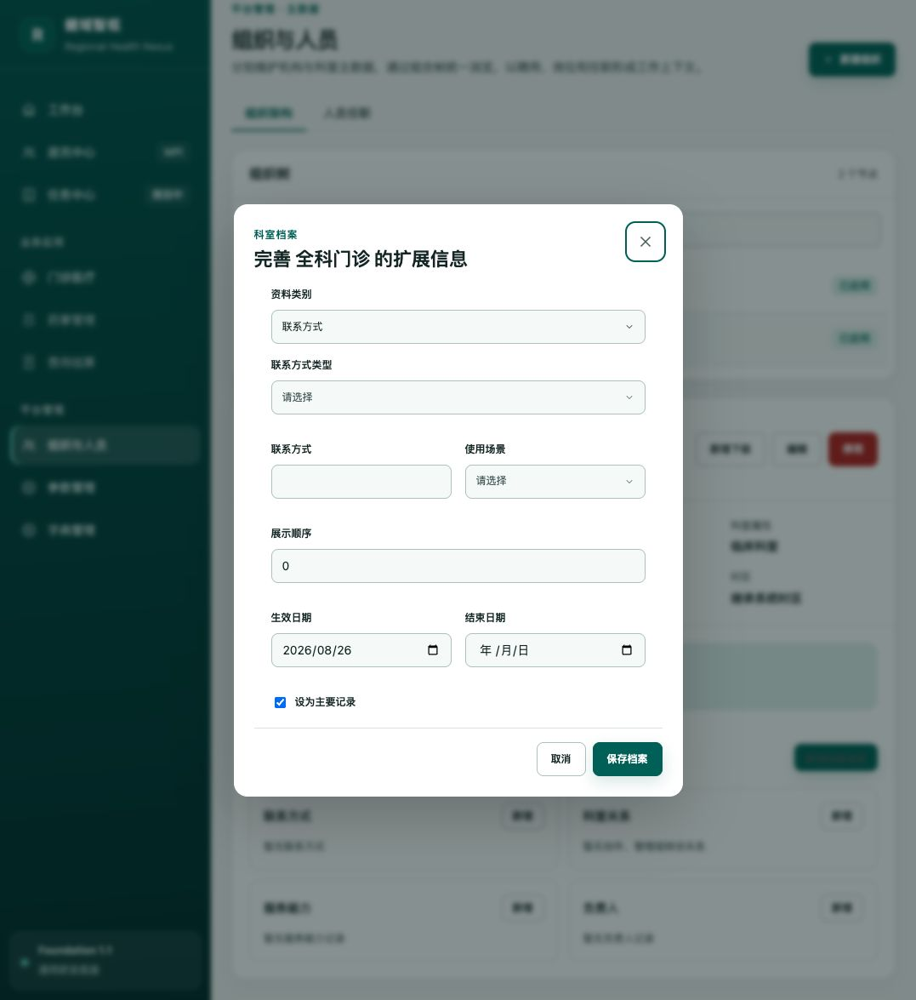

# 机构、科室、人员维护体验走查

日期：2026-08-26

## 结论

整体可用，组织与科室维护已经形成清楚的“目录—详情—弹窗”结构，宽屏布局、表单分组和校验反馈表现较好。当前主要短板集中在人员首次使用状态、数据增长后的检索能力，以及页签和树形列表的键盘操作。

建议健康度：7/10。完成 P1 项后可作为后续业务模块的稳定维护界面范式。

## 走查范围

- 组织与人员入口及默认机构详情
- 科室选择、详情、编辑和档案维护
- 新建组织和新增人员的必填校验
- 人员目录空状态
- 1077px 默认窗口与 1366px 宽屏布局
- 页签、组织树、弹窗关闭和焦点返回的键盘操作

本轮未写入或修改业务数据。

## 流程步骤

### 1. 机构默认详情：良好

组织树、机构摘要和档案卡片的层级清楚；机构名称、代码、状态和主要操作容易识别。默认窗口下目录与详情上下排列，档案卡片需要滚动后才能完整浏览，紧凑度一般。

### 2. 科室详情切换：良好

机构和科室共用同一浏览结构，用户不需要切换页面。选中状态明显，科室属性、说明和档案治理信息齐全。“科室属性”和“结构类型”在示例中都显示为“临床科室”，语义区分不够直观。

### 3. 科室编辑：良好

弹窗宽度适中，字段采用两列布局，代码只读、父级和科室类型使用下拉框，操作区固定在底部。字段较多但仍能在当前窗口完整展示。

### 4. 新建组织校验：良好

提交空表单后，错误紧邻字段显示，并将焦点移动到第一个错误字段。缺少提交前的必填标识和代码格式说明，用户只能在失败后得知规则。

### 5. 科室档案维护：良好

不同档案类型集中在一个弹窗中维护，日期、主记录和展示顺序清楚。详情区同时提供“新增档案信息”和每张卡片内的“新增”，入口重复，增加了轻微视觉噪声。

### 6. 人员目录空状态：需优化

空状态文案能够说明下一步，但目录区和详情区分别显示一个大面积空状态，信息重复且占用大量空间。空状态内部没有直接的“新增人员”按钮，首次使用者需要回到页面右上角操作。

### 7. 新增人员校验：良好

表单简洁，姓名、代码和性别三项足以完成主数据创建。错误提示和首错聚焦有效，按 Esc 可关闭弹窗，并将焦点返回“新增人员”按钮。

### 8. 宽屏组织布局：良好

1366px 宽屏下目录与详情并排，信息密度合理，选择组织后无需离开上下文即可维护详情。这是本模块最适合作为其他主数据页面参考的布局状态。

### 9. 宽屏人员空状态：需优化

两列布局在有数据时合理，但无人员时形成两个高度接近整屏的空白面板。建议首次使用时合并为单一引导区；创建第一位人员后再恢复目录—详情结构。

## 主要问题与建议

| 优先级 | 问题 | 建议 |
| --- | --- | --- |
| P1 | 人员目录没有名称或代码检索入口，数据增长后定位人员成本会快速上升 | 在人员目录头部增加与组织树一致的搜索框，支持姓名、人员代码和拼音首字母 |
| P1 | 人员空状态重复且占用整屏，首次操作入口距离提示较远 | 无人员时合并左右面板，在空状态内提供“新增人员”主按钮；有数据后恢复双栏 |
| P1 | 页签不支持左右方向键，组织树不支持上下方向键；树节点全部进入 Tab 顺序 | 为页签和组织树增加方向键、Home/End 与移动焦点逻辑；采用单一 Tab 停靠点，并补充树层级语义 |
| P1 | “停用”是高风险操作，但当前入口表现为可直接执行 | 增加确认弹窗，说明影响对象和生效范围；成功后给出明确反馈，条件允许时提供短时撤销 |
| P2 | 新建表单提交前看不到必填项和代码格式 | 在必填标签中增加统一标识，并在代码字段下提供简短格式提示 |
| P2 | 档案区存在总入口和卡片入口两套“新增” | 保留卡片内就近新增；总入口改为类别菜单，或在卡片入口完整时移除 |
| P2 | 中等宽度下组织目录和详情改为上下排列，首屏纵向较长 | 目录在节点较少时采用紧凑高度；节点较多时保持内部滚动，并考虑可折叠目录 |
| P3 | “结构类型”和“科室属性”可能显示相同文本，用户难以理解区别 | 调整为“组织结构类型”和“业务属性”，并在编辑表单中提供简短说明 |

## 已确认的优点

- 机构与科室共用一套信息架构，学习成本低。
- 宽屏目录—详情布局稳定，选中态和状态标签清楚。
- 弹窗大小、字段间距和两列分组总体合理。
- 下拉框名称与编码并列显示，适合主数据维护。
- 表单错误贴近字段，首错自动聚焦。
- 弹窗支持 Esc 关闭并恢复触发按钮焦点。
- 当前走查期间控制台没有错误或警告。

## 可访问性风险与验证边界

- 已确认页签和组织树缺少方向键切换，这是键盘操作风险。
- 组织树只有视觉缩进，尚未看到层级、展开或折叠状态的完整辅助技术表达。
- 本轮没有使用屏幕阅读器，因此不能宣称满足完整的 WCAG 要求。
- 当前租户没有人员数据；为避免写入业务数据，本轮未进入已选人员详情、聘用关系和科室任职弹窗，也未验证这些操作的保存反馈。
- 未执行“停用”等会改变业务状态的操作。

## 推荐实施顺序

1. 先补人员检索、人员空状态 CTA、页签/树键盘操作和停用确认。
2. 再统一必填标识、代码格式提示和档案新增入口。
3. 最后压缩中等宽度下的垂直空间，并优化相近字段名称。
