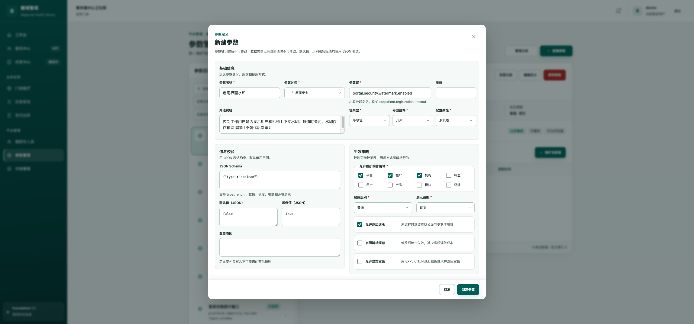
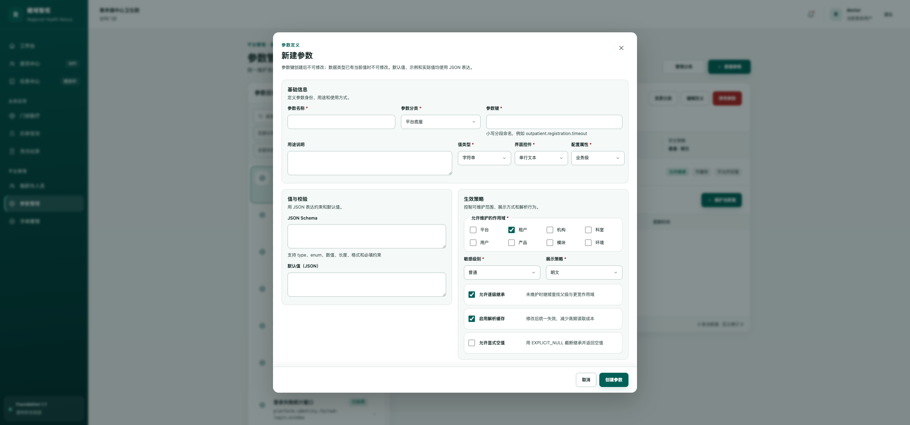

# 参数新建表单字段精简与状态隔离

- 日期：2026-08-27
- 页面：`/settings/parameters`
- 工具：ego-lite

## 调整内容

- 从参数定义表单移除“单位”“示例值（JSON）”“变更原因”。
- 新建模式不再接收当前选中参数的数据。
- 新建和编辑使用独立组件实例，模式或参数变化时强制初始化对应表单状态。
- 删除字段不再参与新建/编辑请求及前端 JSON 校验。

## 问题原因

参数管理页打开新建弹窗时，仍将当前选中的参数详情传给表单组件。表单状态因此按编辑数据初始化，出现标题为“新建参数”，内容却来自已有参数的情况。

## ego-lite 验证

1. 优化前直接打开新建：名称为“启用界面水印”，参数键和 JSON 同样带入已有值。
2. 优化后直接打开新建：名称、参数键、JSON Schema、默认值均为空，仅保留分类和策略默认值。
3. 先打开“编辑参数定义”并确认已有数据，再取消并打开“新建参数”：所有文本内容仍为空。
4. “单位”“示例值”“变更原因”在新建和编辑界面均不存在。
5. 空表单提交显示名称和参数键必填错误，没有创建数据。
6. 1077 × 900 下无横向溢出，底部操作区可见；控制台无错误或警告。

## 证据

### 优化前

### 优化后

## 自动检查

- UI 规范检查：通过
- TypeScript 编译：通过
- 生产构建：通过
