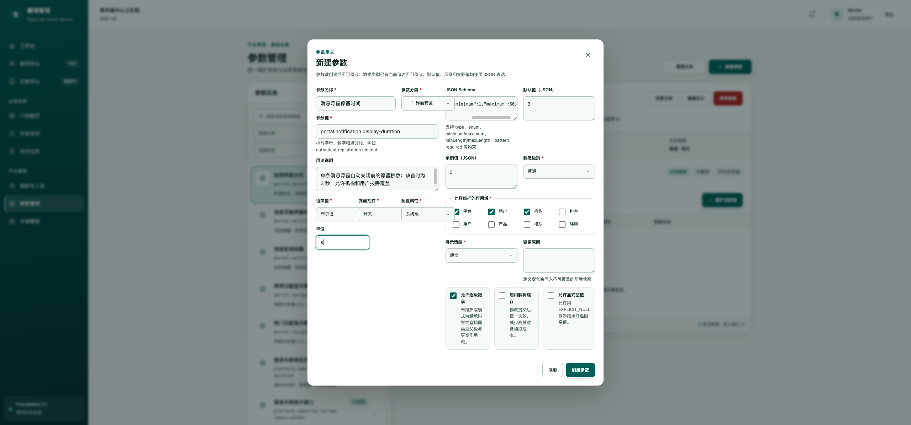
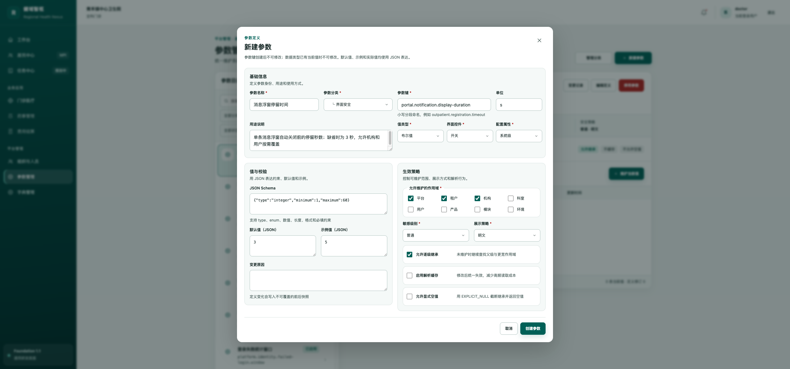
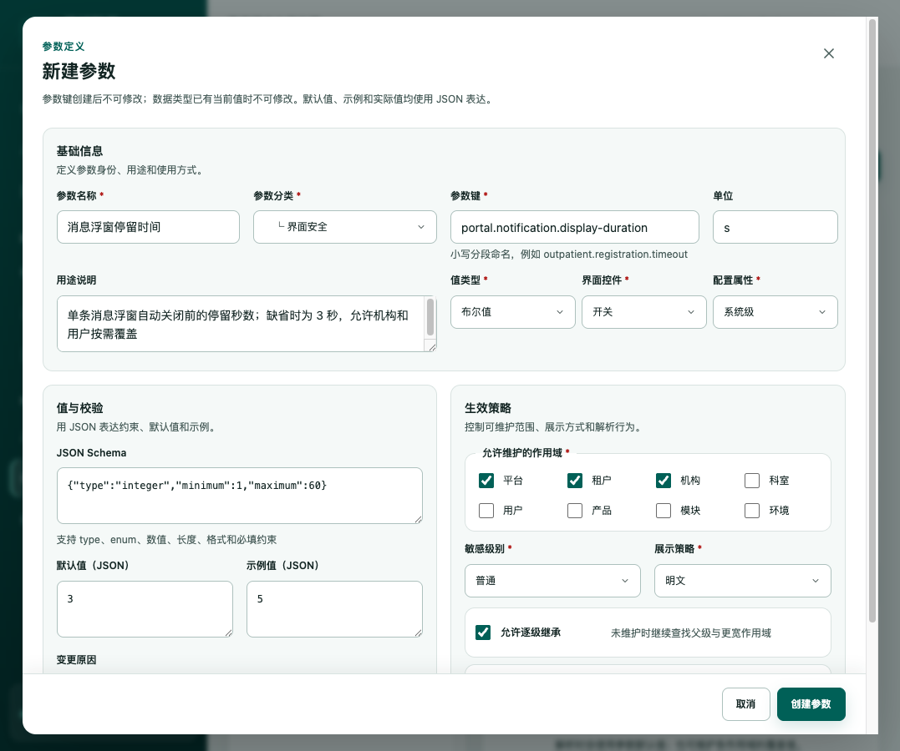
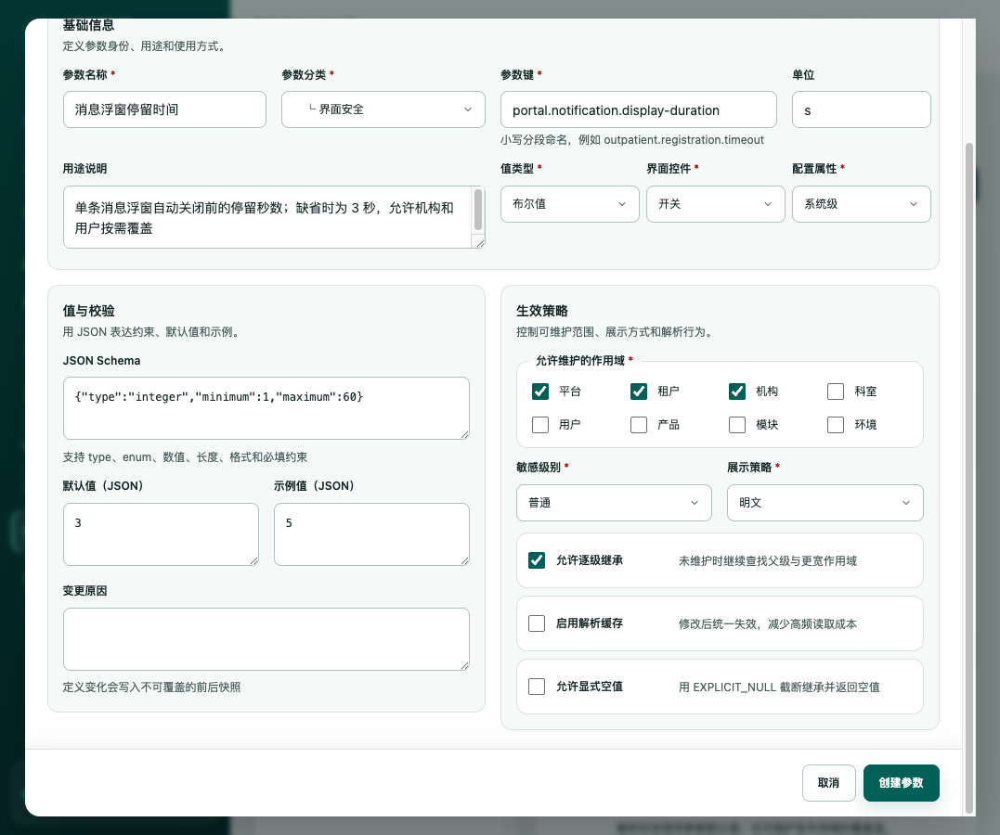

# 参数定义弹窗走查与优化记录

- 日期：2026-08-27
- 页面：`/settings/parameters`
- 范围：新建/编辑参数定义弹窗
- 工具：ego-lite
- 结论：原弹窗功能可用但信息组织混乱；已重构为宽屏、分区明确且可稳定滚动的布局。

## 流程健康度

1. 打开“新建参数”：较差（优化前）
   - 弹窗宽 832 px、高 973 px，无页面溢出，但缺少清晰分区。
   - 左右栏高度分别约 458 px 和 740 px，产生明显失衡与左下空洞。
2. 填写参数身份与 JSON 配置：较差（优化前）
   - JSON Schema 内容宽 323 px、可视区仅 200 px，依赖横向滚动且当前视图会隐藏开头。
   - 三个策略卡片仅约 125–146 px 宽、高约 176 px，标题与说明被迫多行折叠。
3. 优化后的完整表单：健康
   - 弹窗扩展为 1024 px 宽，按“基础信息 / 值与校验 / 生效策略”组织。
   - 基础信息全宽展示；下方两个区域各 480 px，视觉权重和阅读顺序一致。
   - JSON 自动换行且可视宽度提升至 437 px，不再出现横向裁切。
   - 策略开关改为 60 px 高的横向条目，标题和说明可快速扫读。
4. 1077 × 900 响应式复测：健康
   - 页面无横向溢出；弹窗在有限高度内滚动。
   - 底部操作区保持吸附，滚动到底后三个策略开关均完整位于操作区上方。
5. 校验与退出：健康
   - 非法 JSON 会显示明确错误并阻止提交。
   - 取消关闭弹窗且未创建数据。

## 本轮改动

- 新增超宽弹窗规格，仅用于复杂参数定义表单。
- 将无标题双栏改为三个有标题、有说明的业务分区。
- 重排字段：身份信息集中在顶部，值约束和生效策略并列。
- JSON 编辑框改为自动换行并保留等宽字体。
- 作用域独立成组；继承、缓存和显式空值改为紧凑横向选项。
- 小屏高度不足时保持底部操作按钮可见。

## 证据

### 优化前

### 优化后

## 可访问性与测试边界

- 保留语义化标题、fieldset、label、必填标识和对话框焦点约束。
- 已验证 JSON 错误提示和取消退出；未执行真实创建或编辑，避免修改业务数据。
- 已检查常规桌面与 1077 × 900 视口；未执行屏幕阅读器实机与完整 WCAG 对比度审计。
- ego-lite 未捕获到控制台错误或警告。

## 自动检查

- UI 规范检查：通过
- TypeScript 编译：通过
- 生产构建：通过
- 仅保留现有大于 500 kB 的分包提示，不影响本轮功能。
