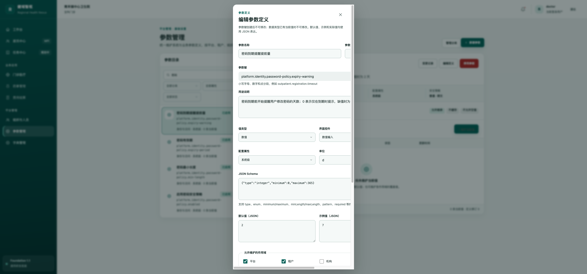
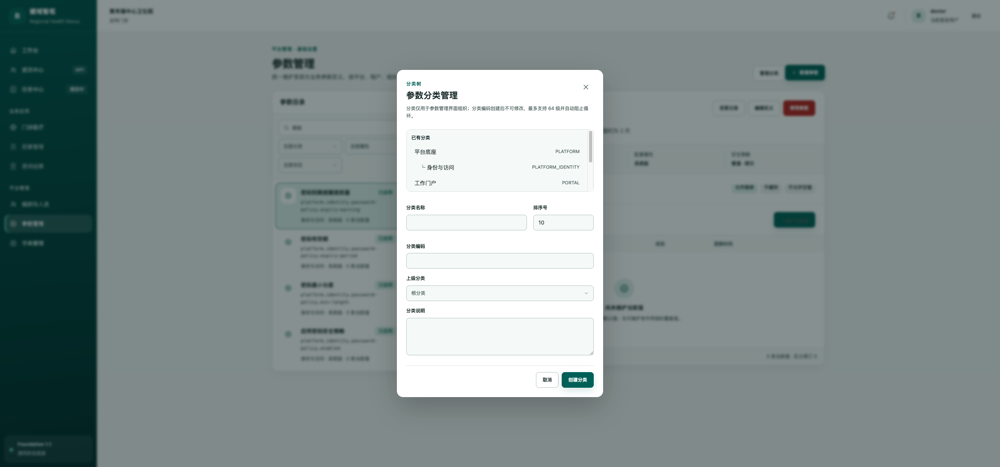
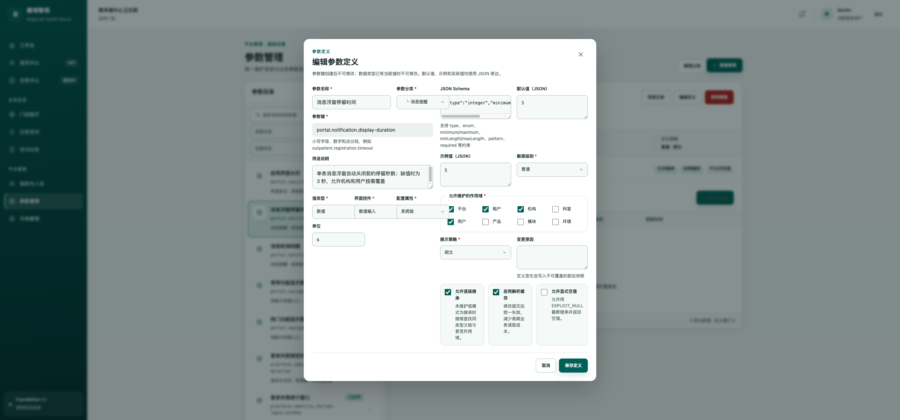
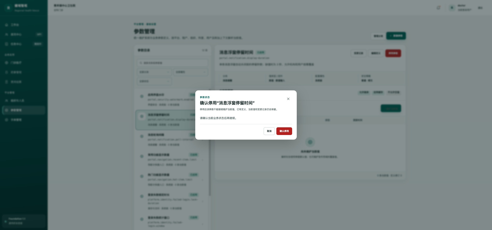
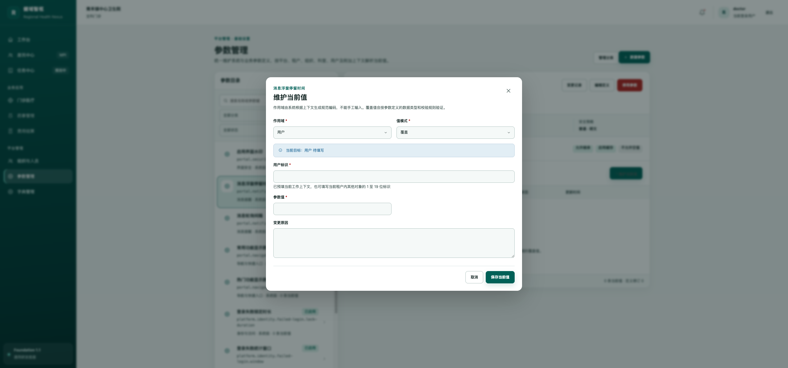
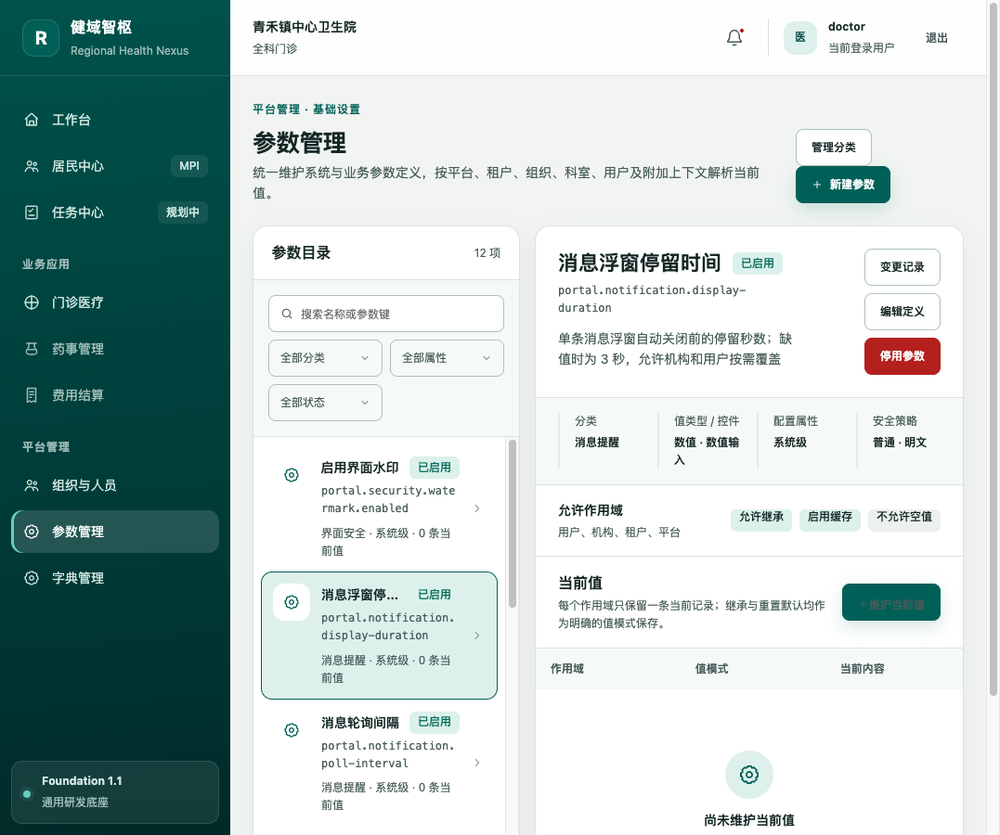

# 参数管理界面走查与优化记录

- 走查日期：2026-08-27
- 页面：`/settings/parameters`
- 工具：ego-lite
- 结论：主要流程可用，已完成本轮发现的高影响布局、交互和校验问题修复；生产构建与 UI 规范检查通过。

## 流程健康度

1. 参数目录浏览：健康
   - 目录、筛选、选中态与详情区层级清晰。
   - 1077 px 宽度下保持双栏且无页面横向溢出，目录宽 288 px、详情宽 462 px。
2. 搜索与键盘选择：健康（已优化）
   - 名称和参数键检索可用，过滤后自动选中第一条。
   - 列表改为单一 Tab 停靠点，并支持上/下/Home/End 键移动选中和焦点。
3. 当前值维护：健康（已优化）
   - 弹窗改为宽屏双栏，832 × 694 px，无横向或纵向裁切。
   - 作用域、对象标识和参数值补齐必填语义与本地校验；数字、布尔和 JSON 值在提交前校验。
4. 参数定义：健康（已优化）
   - 原弹窗 528 × 1156 px，存在横向裁切和滚动条；现改为“基础信息 / 策略与约束”双区宽屏布局，832 × 973 px，无内部滚动或横向溢出。
   - 参数键按服务端规则提前校验；JSON Schema、默认值和示例值提交前验证 JSON 格式。
5. 参数分类：健康（已优化）
   - 新建分类采用“分类列表 + 编辑区”宽屏布局，832 × 551 px。
   - 修复从新建切换到编辑时名称、编码未回显的问题；分类编码规则与必填标识已补齐。
6. 状态变更：健康（已优化）
   - 停用参数由直接执行改为二次确认，并说明影响范围，避免误操作。
7. 变更记录：健康
   - 弹窗尺寸、信息层级和关闭操作正常。

## 本轮主要问题与处理

| 级别 | 问题 | 处理结果 |
| --- | --- | --- |
| P1 | 参数定义弹窗窄长、内容横向被裁切 | 改为宽屏双区布局，消除横向滚动与裁切 |
| P1 | 分类编辑打开后名称、编码为空 | 通过对话框状态隔离修复正确回显 |
| P1 | 参数目录所有条目均进入 Tab 顺序 | 改为 roving tabindex，并补齐方向键导航 |
| P1 | 停用参数无确认 | 增加影响说明和危险操作确认 |
| P2 | 必填字段缺少明确语义 | 增加可见星号及 `aria-required` |
| P2 | JSON 与编码规则主要依赖服务端 | 增加前端即时校验和清晰错误提示 |
| P2 | 分类、当前值弹窗比例偏长 | 统一改为宽屏、紧凑的双栏布局 |

## 关键证据

### 优化前

### 优化后

## 可访问性与测试边界

- 已覆盖键盘焦点停靠、方向键导航、必填语义、对话框可见性与基本错误提示。
- 本轮未执行屏幕阅读器实机测试、完整 WCAG 对比度审计和移动端触控专项测试。
- 为避免改变现有业务数据，状态变更与当前值保存只验证到确认/校验阶段，未执行最终提交。
- ego-lite 复测期间未捕获到控制台错误或警告。

## 自动检查

- `npm run ui:check`：通过
- `tsc -b && vite build`：通过
- 构建仅保留现有的大于 500 kB 分包提示，不影响本轮功能。
