# 库房业务界面信息完整性审查

- 审查日期：2026-08-30
- 审查范围：采购验收、科室请领、库间调拨、库存盘点、追溯码、账目校验、库存查询、库位、经营项目
- 审查方式：ego-lite 宽屏实机走查（2560 × 1196）+ 前端展示代码与 API 数据结构核对
- 总体结论：布局和基础交互已达到可用水平，但业务信息完整性约为“可演示、未达到正式库房作业要求”。采购到货、科室请领、库存盘点、调拨接收存在会影响业务判断或账目准确性的关键字段缺口，应优先补齐。

## 结论摘要

| 模块 | 健康度 | 当前正确显示 | 主要缺口 |
| --- | --- | --- | --- |
| 采购验收 | 有高风险缺口 | 单号、日期、供应商、明细数、状态 | 到货单号、生产日期、有效期、收货库位选择、到货进度、采购金额 |
| 科室请领 | 有高风险缺口 | 请领单号、时间、用途、项目数、状态 | 申请科室/领用科室、期望日期、紧急程度、申请/批准/实发量、批次拣货明细 |
| 库间调拨 | 部分完善 | 调拨单号、方向、目标站点、状态 | 批号以内部 ID 展示、缺效期，缺申请/批准/调出/调入/破损数量对照 |
| 库存盘点 | 有高风险缺口 | 盘点单、快照时间、范围、差异数、状态 | 未开放项目/循环盘点，实盘默认等于账面，批次显示内部 ID，缺盲盘与复盘信息 |
| 追溯码 | 基本完善 | 追溯码、药品、批号、余量、库位、状态、单据、时间轴 | 缺效期、包装规格/换算、事件操作人；筛选后指标不是全库总量 |
| 账目校验 | 基本完善 | 校验状态、维度数、差异数、四类差异、拆零余额 | 运行类型、业务日期、执行人、耗时未展示；拆零台账缺批号、追溯码、最后业务 |
| 库存查询 | 部分完善 | 批号、效期、状态、账面/预留/冻结/可用量 | 已获取但未展示平均成本和流水明细；缺包装数量换算、临期标识和更新时间 |
| 库位 | 当前模型内正确 | 编码、名称、类型、默认状态、收/拣/盘权限、排序 | 缺温湿度/冷链、受控药品、容量、条码等库位约束 |
| 经营项目 | 部分完善 | 药品编码、包装规格、换算系数、出库策略、批号/追溯/冷链/受控/高警示 | “允许拆零”配置未在列表显示；不能维护已调入项目；整批统一安全属性容易覆盖药品主数据差异 |

## 最高优先级问题

### P0-1 采购到货未展示和录入有效期等关键批次属性

API 已支持 `deliveryNoteNo`、`productionDate`、`expiryDate`，但批量登记到货界面只录入本次到货数和批号，并自动使用第一个可收货库位。药品入库缺少有效期会直接影响近效期先出和临期预警，自动选首个库位也可能造成货位错误。

建议：逐行显示包装单位、剩余可到货量、本次到货量、批号、生产日期、有效期、收货库位、包装单价；单据头增加送货单号和到货时间。批号管理药品应强制批号，有效期管理药品应强制有效期。

### P0-2 科室请领缺少领用主体，审批无法调整数量

数据模型已返回 `requestingDepartmentId`，后端也支持请求科室和目标库存站点，但界面没有展示或选择申请科室/领用科室。列表只汇总申请量，审批动作默认将全部申请量作为批准量，没有展示批准量、已拣量和实发量。

建议：明确“申请科室、发出库房、收货站点、申请人、期望领用日期、紧急程度”；审批和拣货必须进入明细界面，可逐项调整批准量并查看 FEFO 分配的批号、效期和库位。

### P0-3 盘点默认把实盘数量填成账面数量

录入实盘界面用账面数量初始化实盘数量，容易导致操作人员未实际清点就直接提交。后端支持 `ITEM`、`CYCLE`，界面仅开放全库和按货位盘点；盘点行还以内部 `stockLotId` 尾号代替真实批号。

建议：默认实盘为空；支持明盘/盲盘策略；开放按经营项目和循环盘点；显示真实批号、效期、库存状态、包装换算，差异行突出显示并要求复核人和原因。

### P0-4 调拨接收把内部批次 ID 当作批号展示

逐批调入确认表显示 `stockLotId`，不是业务人员识别的批号，也没有有效期。列表仅显示项目数，没有申请、批准、调出、正常调入、破损量之间的对照。

建议：接口或前端关联真实批号和效期；调入确认按“药品/规格、批号、效期、调出数、正常入库、破损/短少、目标库位、差异原因”展示。

## 其他重要改进

1. 采购单和到货验收单混在一张表中，“供应商 / 来源”列在验收单行实际显示采购单号，列语义不一致。建议拆成“采购单”和“到货验收”两个子视图，或增加单据类型列。
2. 采购单列表缺预计到货日、采购总额、已到/未到进度；接口已有 `expectedDate`、`receivedQuantity`、`remainingQuantity`。
3. 实时库存接口已有 `averageUnitCost`、`projectedAt` 和完整库存流水，但页面只展示流水笔数。建议增加“包装数量/基本数量”双单位展示与流水抽屉。
4. 追溯码事件已有 `occurredBy`、站点和库位变化，但详情时间轴只展示单据与数量变化。建议补充操作人、来源/去向以及效期。
5. 账目校验记录已有 `runType`、`businessDate`、`runBy`、开始/结束时间，建议在结果头部展示，便于审计。
6. 经营项目列表漏掉 `splitAllowed`，且批量调入对所有选中药品统一设置批号、追溯、冷链、受控、高警示属性。建议以药品主数据为默认且不可无提示覆盖，并逐项标记“继承/本库覆盖”。
7. 业务列表普遍只有“项目数”，没有详情入口。审核、出库、调拨、盘点等不可逆动作前应能展开逐项明细。

## 已确认的优点

- 当前机构、当前科室、库房类型一直可见，业务上下文清楚。
- 九个业务入口结构统一，空状态均说明下一步，供应商缺失时可直接跳转维护。
- 批量请领、调拨、经营项目调入均使用宽屏批量表格，布局紧凑，没有横向溢出。
- 库存查询中的账面、预留、冻结、可用量关系正确，追溯码余量和拆零账目校验也已进入页面。
- 对话框关闭按钮、库位新增按钮具备可访问名称；未发现页面级横向溢出或接口告警。

## 可访问性风险与证据限制

- 追溯码搜索框依赖占位文字，没有稳定的可访问名称，建议补充 `aria-label` 或可见标签。
- 本轮没有真实采购、请领、调拨、盘点历史数据，因此详情态与异常态主要通过界面代码和 API 数据结构核对，未执行不可逆提交动作。
- 截图无法证明完整键盘操作、焦点顺序和读屏兼容性；只能确认当前宽屏布局、可见标签和 DOM 中的部分可访问名称。

## 走查步骤与截图

1. 采购验收列表：布局健康，空状态明确。
   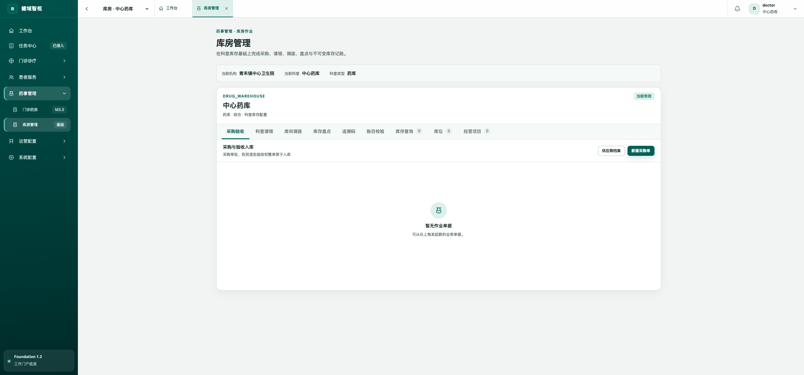
2. 采购前置条件：供应商缺失时阻断正确，并给出直接入口。
   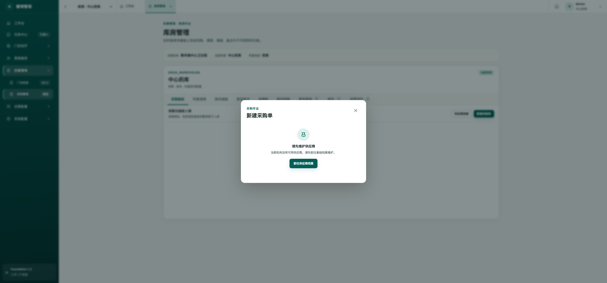
3. 科室请领列表：布局健康，信息不足。
   
4. 新建请领：批量选择合理，但缺领用主体和日期等上下文。
   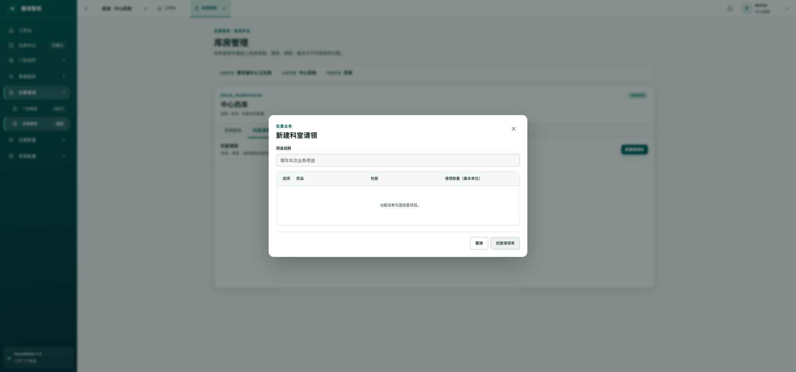
5. 新建调拨：目标站点明确，缺计划日期和更多数量维度。
   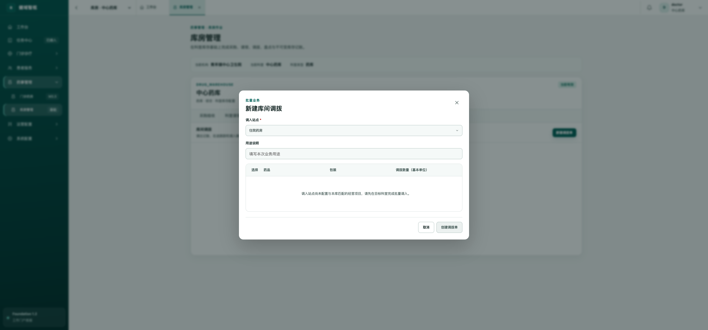
6. 新建盘点：界面简洁，但盘点范围能力未完整开放。
   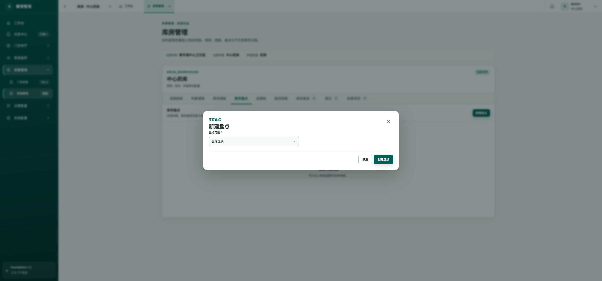
7. 追溯码：搜索、状态和指标完整，需补效期和操作人。
   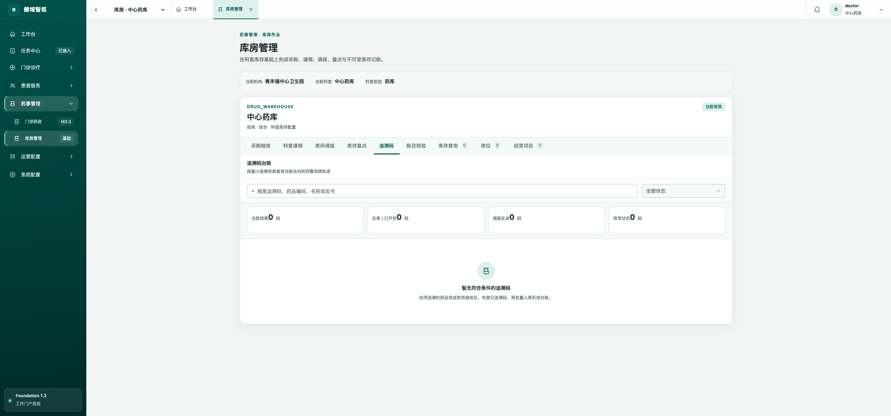
8. 账目校验：四类账目关系清楚，需补运行审计属性。
   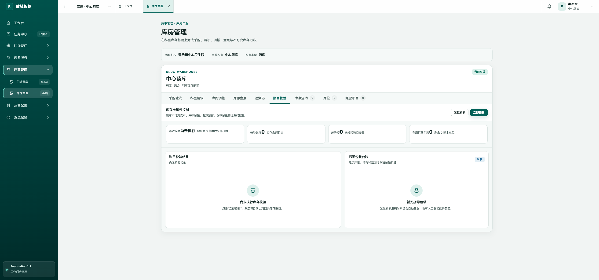
9. 库存查询：核心数量结构正确，成本和流水信息未展开。
   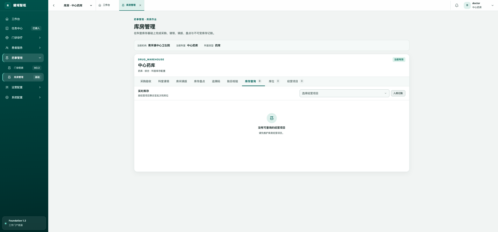
10. 库位树：结构清楚，适合层级维护。
    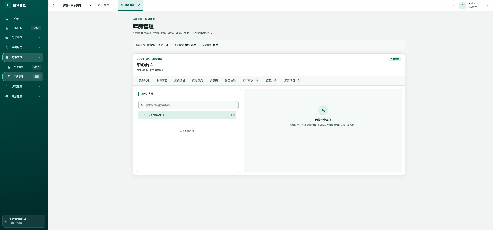
11. 经营项目：空状态和批量入口清楚。
    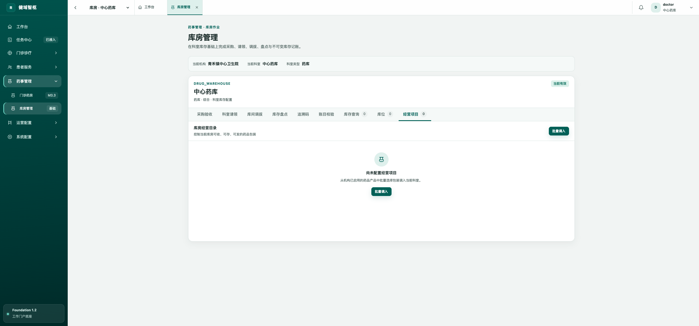
12. 批量调入：产品、厂家、包装和策略信息较完整，但整批安全属性需要约束。
    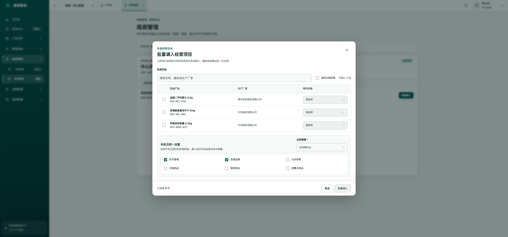
13. 新建库位：当前模型内字段排列合理，缺少药品库房特有环境约束。
    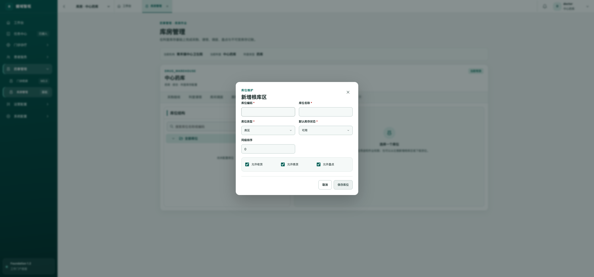
